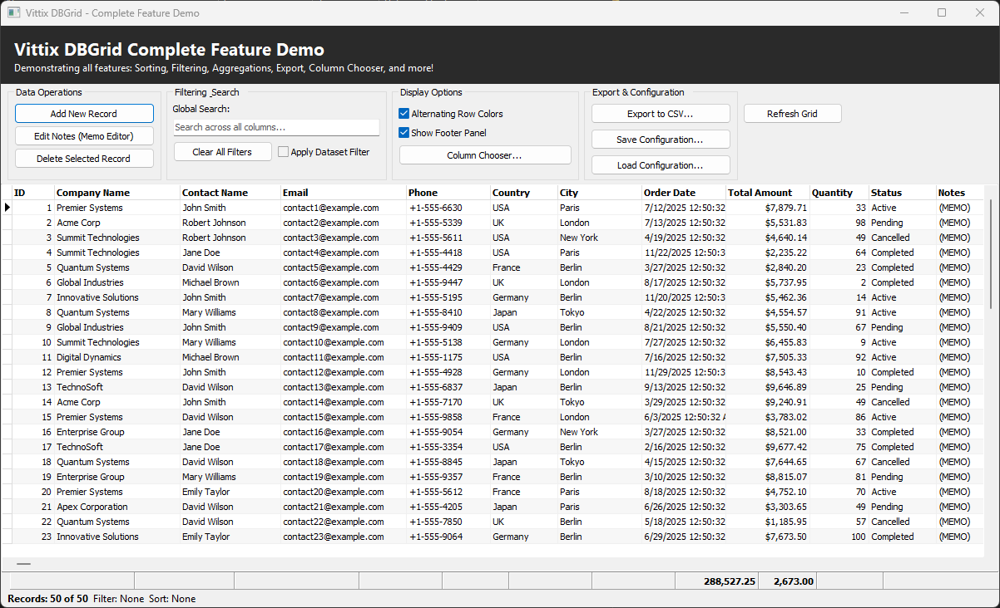
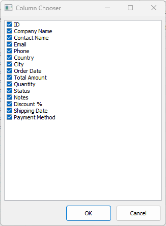
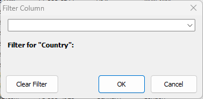

# Vittix.DBGrid

**Vittix.DBGrid** is a modern, feature-rich replacement for Delphi’s standard `TDBGrid`, built for professional VCL applications that need advanced data visualization, extensibility, and performance.

---

## 📸 Screenshot





> Example showing sorting, filtering, footer aggregations, and column chooser enabled.

---

## ✨ Features

- 🔀 Multi-column sorting engine
-  Advanced filtering with popup UI
- 📊 Aggregation engine (SUM, COUNT, AVG, MIN, MAX)
- 📌 Footer panel with live calculations
- 🧩 Runtime column chooser
- ✏️ Custom in-place editors
- 🎛 Controller-based architecture
- ⚡ Optimized for large datasets
- 🧱 Pure Object Pascal (Delphi VCL)

---

## 📦 Package Structure

The component is delivered using **Delphi runtime and design-time packages**.

### 🔹 Runtime Package

```yaml
VittixDBGridControllerR.dpk
```

Contains all runtime logic required by applications:

- Core `TVittixDBGrid` implementation
- Sorting engine
- Filtering engine
- Aggregation engine
- Footer panel logic
- Column metadata & controller logic
- Custom editors

This package **must be included** with your application.

---

### 🔹 Design-Time Package

```markdown
VittixDBGridControllerD.dpk
```

Provides IDE integration and component registration:

- Registers `TVittixDBGrid` in the Tool Palette
- Enables design-time support
- Depends on `VittixDBGridControllerR.dpk`

---

## 📦 Main Units

- `Vittix.DBGrid.pas`
- `Vittix.DBGrid.Controller.pas`
- `Vittix.DBGrid.ColumnInfo.pas`
- `Vittix.DBGrid.ColumnChooser.pas`
- `Vittix.DBGrid.Sort.Engine.pas`
- `Vittix.DBGrid.Filter.Engine.pas` – Filtering engine
- `Vittix.DBGrid.Filter.Popup.pas` – Filter popup UI
- `Vittix.DBGrid.Aggregation.Engine.pas` – Aggregation engine
- `Vittix.DBGrid.FooterPanel.pas` – Footer rendering
- `Vittix.DBGrid.Editors.pas` – Custom editors
- `Vittix.DBGrid.Reg.pas` – Design-time registration

---

## 🧰 Requirements

- Delphi XE7 or newer (tested up to Delphi 11/12)
- VCL framework
- Any `TDataSet` descendant (FireDAC, dbExpress, etc.)
- `Vcl.DBGrids`
- Any `TDataSet` descendant:
  - FireDAC
  - dbExpress
  - BDE
  - ClientDataSet
  - Third-party datasets

---

## 🚀 Installation

### ✅ Recommended (Package Installation)

1. Open the runtime package:
```lua
VittixDBGridControllerR.dpk
```
Build the package.

2. Open the design-time package:
```yaml
VittixDBGridControllerD.dpk
```
Install the package.

3. Restart Delphi.

The **Vittix.DBGrid** component will appear in the Tool Palette.

---

### ⚙ Manual Installation (Source Only)

1. Add the source folder to **Library Path**
2. Add required units to your project
3. Compile

> ⚠ Manual installation does **not** include design-time support.

---

## 🧪 Basic Usage

```pascal
uses
  Vittix.DBGrid;

var
  Grid: TVittixDBGrid;
begin
  Grid := TVittixDBGrid.Create(Self);
  Grid.Parent := Self;
  Grid.Align := alClient;
  Grid.DataSource := DataSource1;
end;
