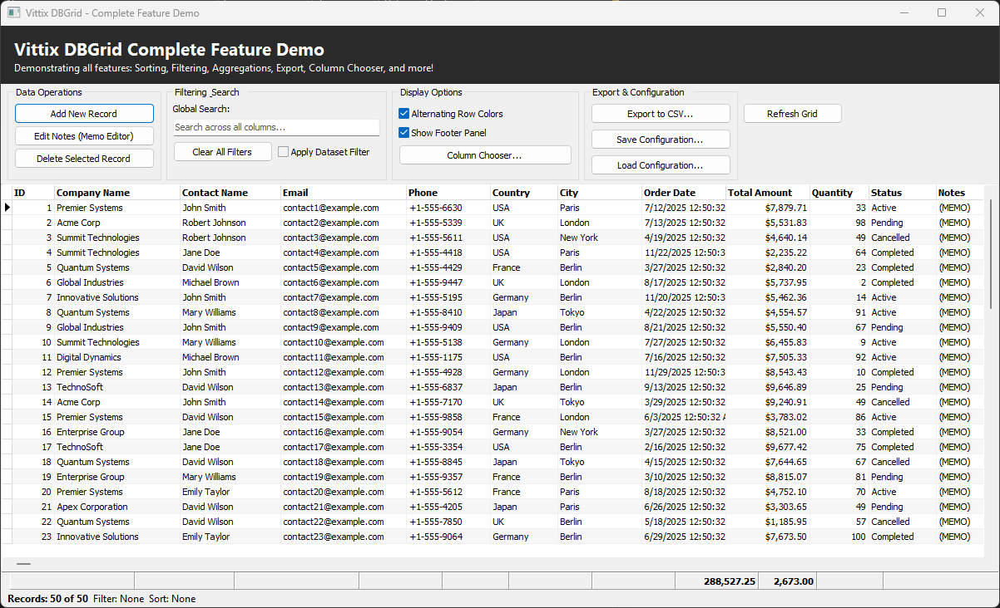
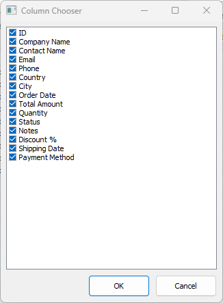
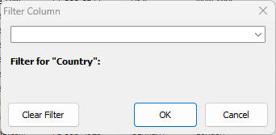

# Vittix.DBGrid

**Vittix.DBGrid** is a modern, feature-rich replacement for Delphi's standard `TDBGrid`, built for professional VCL applications that need advanced data visualization, extensibility, and performance.

---

## Screenshot





> Example showing sorting, filtering, footer aggregations, and column chooser enabled.

---

## Features

- Multi-column sorting engine
- Advanced filtering with popup UI and operator syntax
- Aggregation engine (SUM, COUNT, AVG, MIN, MAX)
- Footer panel with live calculations
- Runtime column chooser
- Custom in-place editors
- Export to CSV, TSV, XLSX, HTML, XML, JSON, Text and clipboard
- DUnitX regression suite (206 tests)
- Controller-based architecture
- Pure Object Pascal (Delphi VCL)

Aggregation performs a full dataset scan per recalculation and filters are
re-evaluated per row — correct for tens of thousands of rows; incremental
aggregation for very large datasets is on the
[roadmap](docs/ROADMAP.md) (item 3.1).

---

## Package Structure

The component is delivered using Delphi runtime and design-time packages.

### Runtime Package

```text
VittixDBGridControllerR.dpk
```

Contains all runtime logic required by applications:

- Core `TVittixDBGrid` implementation
- Sorting engine
- Filtering engine
- Aggregation engine
- Footer panel logic
- Column metadata and controller logic
- Custom editors
- Export engine and dialogs

This package must be included with your application.

---

### Design-Time Package

```text
VittixDBGridControllerD.dpk
```

Provides IDE integration and component registration:

- Registers `TVittixDBGrid` in the Tool Palette
- Enables design-time support
- Depends on `VittixDBGridControllerR.dpk`

---

## Main Units

- `Vittix.DBGrid.pas`
- `Vittix.DBGrid.Controller.pas`
- `Vittix.DBGrid.ColumnInfo.pas`
- `Vittix.DBGrid.ColumnChooser.pas`
- `Vittix.DBGrid.Sort.Engine.pas`
- `Vittix.DBGrid.Filter.Engine.pas` - Filtering engine
- `Vittix.DBGrid.Filter.Popup.pas` - Filter popup UI
- `Vittix.DBGrid.Aggregation.Engine.pas` - Aggregation engine
- `Vittix.DBGrid.FooterPanel.pas` - Footer rendering
- `Vittix.DBGrid.Editors.pas` - Custom editors
- `Vittix.DBGrid.Export.Engine.pas` - Export engine
- `Vittix.DBGrid.Export.Dialog.pas` - Export dialog
- `Vittix.DBGrid.Reg.pas` - Design-time registration

---

## Requirements

- Delphi 12 Athens (the supported toolchain; packages, tests and installer are built for it)
- VCL framework
- `Vcl.DBGrids`
- `TDataSet` descendants such as FireDAC, ClientDataSet, BDE, ADO, and third-party datasets

> Sorting uses the dataset's `IndexFieldNames` mechanism. Datasets that do
> not publish `IndexFieldNames` (for example `TADODataSet`) raise a clear
> `EVittixSortError` when a sort is applied instead of silently doing
> nothing. On a header click the sort state is rolled back and the error
> is reported through `OnSortError` when a handler is assigned, or
> re-raised otherwise. `TClientDataSet` descendants get true descending
> indexes; other datasets use the FireDAC-style `:D` suffix.

---

## Installation

### Recommended (Package Installation)

1. Open the runtime package:

```text
VittixDBGridControllerR.dpk
```

Build the package.

2. Open the design-time package:

```text
VittixDBGridControllerD.dpk
```

Install the package.

3. Restart Delphi.

The `Vittix.DBGrid` component will appear in the Tool Palette.

---

### Manual Installation (Source Only)

1. Add the source folder to the Library Path.
2. Add the required units to your project.
3. Compile.

> Manual installation does not include design-time support.

---

## Basic Usage

```pascal
uses
  Vittix.DBGrid;

var
  Grid: TVittixDBGrid;
begin
  Grid := TVittixDBGrid.Create(Self);
  Grid.Parent := Self;
  Grid.Align := alClient;
Grid.DataSource := DataSource1;
end;
```

---

## Export

`TVittixDBGridExporter` (drop it next to the grid, or use the grid's export
dialog) writes the visible/selected columns of the bound dataset:

| Format | Notes |
|--------|-------|
| `vefCSV` / `vefTSV` | RFC 4180 quoting, formula-injection neutralization for text |
| `vefExcelXLSX` | Built-in SpreadsheetML writer; numbers stored as numeric cells |
| `vefHTML` | Styled table, display formatting |
| `vefXML` / `vefJSON` | Typed values (numbers, `true`/`false`, `null`); JSON parses cleanly |
| `vefText` | Fixed-width text |
| `vefClipboard` | Any text format to the clipboard |

Options (`Export`): `ExportVisibleOnly`, `ExportFilteredOnly`, `IncludeHeaders`,
`IncludeFooter` (aggregation/footer text row), date/time/float/currency
formats, delimiter/quote/encoding, and an `OnProgress` callback with
cancellation.

Behavior worth knowing:

- **Machine-readable vs display formats.** CSV, TSV, XML, JSON and XLSX
  write numbers with full precision and an invariant decimal separator.
  HTML and Text keep the configured display formats (`FloatFormat`,
  `CurrencyFormat`). Set `ExportLocaleFormat := True` to make the
  machine formats use the locale-aware display formatting instead (for
  consumers who open exports in comma-decimal Excel).
- **Dataset friendly.** Exports preserve the current record, temporarily
  lift the grid's filter when `ExportFilteredOnly = False`, and support
  cancellation through `OnProgress` or `Cancel`.
- **Atomic files.** File exports stage a temp file and swap it over the
  target, so a cancelled or failed export never destroys the previous file.

---

## Filter Operator Syntax

Column filters accept a typed operator prefix (also selectable in the
popup):

| Prefix | Operator | Example |
|--------|----------|---------|
| *(none)* | Contains | `alpha` |
| `=` | Equals | `=Alpha` |
| `^` | Starts With | `^Al` |
| `$` | Ends With | `pha$` |
| `!` | Does Not Contain | `!alpha` |
| `<>` | Not Equals (exact) | `<>Alpha` |
| `>` `>=` `<` `<=` | Numeric comparison | `>250` |
| `..` | Between (pipe-separated) | `150..300` → `>150 \| <300` |
| `!..` | Not Between | `!150..300` |
| `null` / `!null` | Is Null / Is Not Null | |
| `empty` / `!empty` | Is Empty / Is Not Empty | |

Comparisons run numerically when both sides parse as numbers, otherwise as
case-insensitive text. The popup persists the chosen operator per column.

---

## Layout Persistence

`TVittixDBGrid` exposes a single persistence root plus per-feature file overrides:

- `PersistenceRootPath`
- `LayoutStorageFileName`
- `ChooserStateFileName`
- `FilterHistoryFileName`

Use `PersistenceRootPath` when you want one folder for all saved grid state. Use the per-feature file properties when you want to direct a specific area to an explicit file.

Current behavior:

- explicit file properties take precedence when set
- `PersistenceRootPath` acts as the shared fallback base
- the component keeps persistence wiring internal; application code configures only `TVittixDBGrid`

### Chooser, filter, and footer behavior

The current chooser and popup surfaces now include a few small but useful affordances:

- chooser search supports multiple terms, a live match summary, `Ctrl+F` focus, `Esc` clear, and `Ctrl+Up` / `Ctrl+Down` reorder
- filter popup supports `Enter` commit, `Esc` cancel, scoped history, distinct-value restriction, and `Not Between`
- footer popup exposes clear-current and clear-all actions, plus keyboard accelerators for those actions

For testability, several of these surfaces expose read-only summary helpers on the corresponding classes. They are intended for regression coverage and diagnostics, not as a new public UI contract.

---

## Testing

The suite is DUnitX-based and covers the export engine, filter engine and
operator table, sort engine, aggregation engine, column info, layout
persistence and controller lifecycle:

```bat
cd tests
build-tests.bat
VittixDBGridTests.exe
```

Set `VITTIX_DELPHI_ROOT` if your Delphi installation is not at the default
`C:\Program Files (x86)\Embarcadero\Studio\23.0`.
